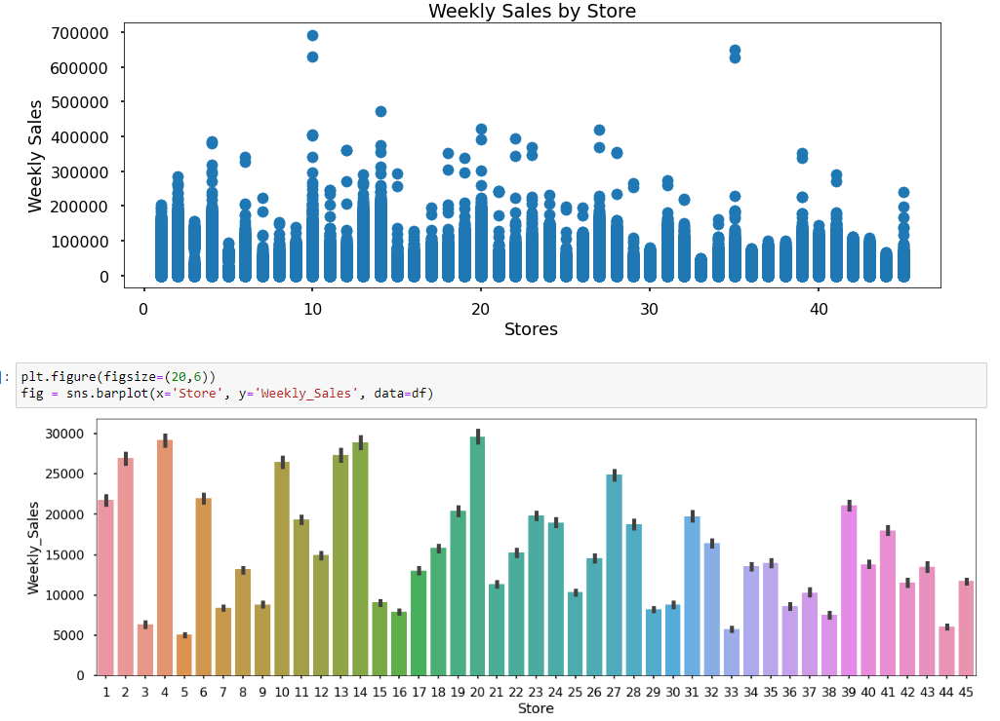
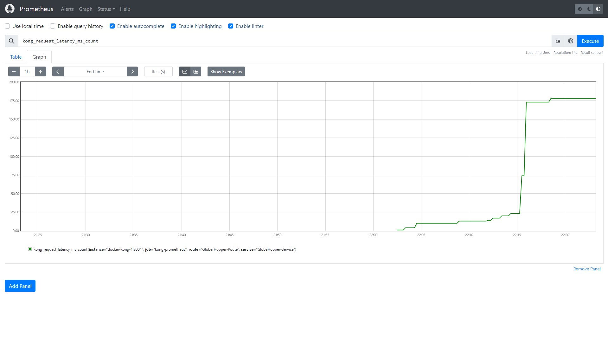
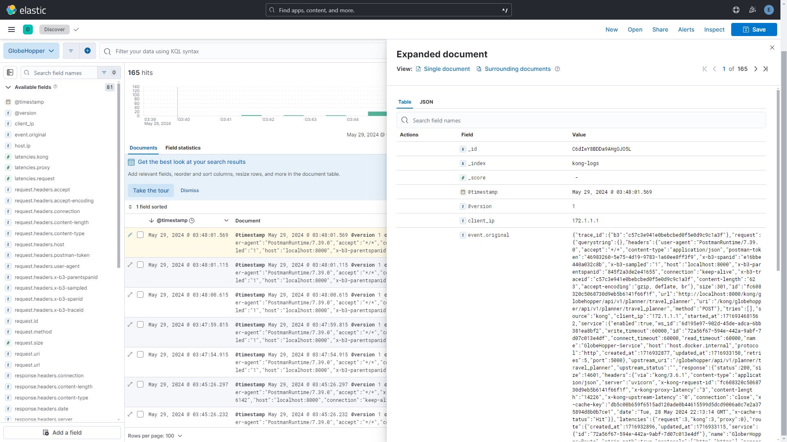

<h1 align="center">B2BMart</h1>

<h4> We are creating an ECommerce Application, to mimic a real-world scenario, then we will collect the data from the platform based on user order, demand, and search history, and based on the data we will create an AI/ML Model to predict the demand and forecast the logistics requirements based on the historical data from the Application.</h4>

<h3>Problem Statement</h3>

<strong>Demand Forecasting</strong><p>Develop a model to identify and analyze factors influencing demand in the logistics industry. Participants should propose methods to predict fluctuations in demand accurately.</p>


<p align="center">
  
</p>

<h2>Step 1</h2>
<ul>
<li>Create a B2B E-commerce site similar to Alibaba or Amazon, with the following features:</li>
<ul>
<li> It will have a feature to register a user based on email, and phone number (via OTP service). Users will be of two types: Seller (who will list/delete the products) and Customer (who can scroll through the catalog and place orders).
    </li><li> User authentication and authorization.
    </li><li> Users will be able to search and sort the product based on the keyword.
    </li><li> Customers will have the option to review or add products to the cart or buy directly.
    </li><li> Users will receive notifications by email and SMS for every activity they do (place an order, cancel an order, etc). 
    </li><li> Users can search through the placed order (order history).
    </li><li> There will be a service that will generate an invoice and share it via Email. Users will have an option too to download it.
</li></ul>
<li>We are creating a Java Spring Boot Application to take care of the Backend API.</li>
<li>We are using Kafka for message-broker.</li>
<li>The Client Side has been written in Angular 17.1.0</li>
<li>We will be creating a product recommendation system using Python, TensorFlow, and ML Ops to deploy a Recommendation System Model in AWS.</li>
</ul>

<h2>Step 2</h2>

<p>To develop a demand forecasting model for the logistics industry, we need to identify the key factors influencing demand and choose appropriate methods for accurately predicting demand fluctuations. Here's a structured approach to help with this task:</p>
    
<h3> 1. Identify Factors Influencing Demand.</h3> 
<ul>
  <li> <strong>Seasonality:</strong> Fluctuations due to seasons, holidays, or specific events (e.g., Black Friday, Christmas).</li>
  <li> <strong>Economic Indicators:</strong> GDP growth, consumer spending, inflation rates, and employment rates.</li>
  <li> <strong>Market Trends:</strong> Changes in consumer behavior, e-commerce growth, and supply chain disruptions.</li>
  <li> <strong>Weather Conditions:</strong> Impact of extreme weather events on transportation and delivery schedules.</li>
  <li> <strong>Competitor Activities:</strong> Pricing strategies, promotions, and service changes by competitors.</li>
  <li> <strong>Regulatory Changes:</strong> New tariffs, trade agreements, or regulations affecting logistics.</li>
  <li> <strong>Technological Advancements:</strong> Adoption of automation, AI, and new technologies affecting logistics processes.</li>
  <li> <strong>Geopolitical Events:</strong> Political instability, trade wars, and global pandemics.</li>    
</ul>
<h3> 2. Data Collection.</h3> 
<ul>
  <li> <strong>Historical Sales and Demand Data:</strong> Time-series data of past demand, categorized by product type, region, and season.</li>
  <li> <strong>Macroeconomic Data:</strong> Information on economic indicators like GDP, CPI, unemployment rates, etc.</li>
  <li> <strong>Weather Data:</strong> Historical weather patterns and forecasts.</li>
  <li> <strong>Competitor Data:</strong> Market research data on competitor actions.</li>
  <li> <strong>Regulatory Data:</strong> Updates on new regulations or tariffs.</li>
  <li> <strong>Geopolitical News:</strong> Data on international events affecting logistics.</li>
</ul>
<h3> 3. Data Preprocessing.</h3> 
<ul>
  <li> <strong>Data Cleaning:</strong> Handling missing values, outliers, and noise in the data.</li>
  <li> <strong>Feature Engineering:</strong> Creating new features from the raw data that might better represent demand drivers (e.g., holiday indicators, lagged demand variables).</li>
  <li> <strong>Normalization and Scaling:</strong> Standardizing data to ensure consistent input ranges.</li>
</ul>
<h3> 4. Model Selection.</h3> 
<ul>
  <li> <strong>ARIMA (Auto-Regressive Integrated Moving Average):</strong> Useful for capturing linear patterns in time series data.</li>
  <li> <strong>Random Forest:</strong> Handles non-linear relationships and interactions between variables.</li>
  <li> <strong>Gradient Boosting Machines (XGBoost, LightGBM):</strong> Effective in capturing complex patterns in data.</li>
  <li> <strong>Recurrent Neural Networks (RNNs) and Long Short-Term Memory (LSTM):</strong> Effective in capturing sequential dependencies in time-series data.</li>
  <li> <strong>Transformers:</strong> Suitable for modeling long-term dependencies and handling large datasets.</li>
</ul>
<h6>Combine traditional time-series models with machine learning methods to capture both linear and non-linear patterns.</h6>
<h3> 5. Model Training and Validation.</h3> 
<ul>
  <li> <strong>Split the Data:</strong> Use techniques like cross-validation to split data into training, validation, and test sets.</li>
  <li> <strong>Train the Model:</strong> Use historical data to train the chosen model.</li>
  <li> <strong>Hyperparameter Tuning:</strong> Use grid search, random search, or Bayesian optimization to fine-tune model parameters.</li>
  <li> <strong>Validation:</strong> Evaluate model performance using metrics like Mean Absolute Error (MAE), Mean Squared Error (MSE), Root Mean Squared Error (RMSE), and Mean Absolute Percentage Error (MAPE).</li>
</ul>
<h3> 6. Model Evaluation.</h3> 
<ul>
  <li> <strong>Backtesting:</strong> Compare the model's forecasts against actual historical demand to assess its accuracy.</li>
  <li> <strong>Scenario Analysis:</strong> Test the model under different hypothetical scenarios (e.g., economic downturns, supply chain disruptions).</li>
</ul>
<h3> 7. Deployment and Monitoring.</h3> 
<ul>
  <li> <strong>Deploy the Model:</strong>  Integrate the model into the existing logistics management systems.</li>
  <li> <strong>Monitor Performance:</strong>  Continuously monitor the model's performance and update it with new data to maintain accuracy.</li>
  <li> <strong>Adjust for External Factors:</strong>  Update the model in response to significant changes in market conditions or other external factors.</li>
</ul>
<h3> 8. Continuous Improvement.</h3> 
<ul>
  <li> <strong>Feedback Loop:</strong> Create a feedback loop to incorporate real-time data and refine the model.</li>
  <li> <strong>Machine Learning Operations (MLOps):</strong> Implement MLOps practices to manage model deployment, versioning, and monitoring in production environments.</li>
</ul>

<h3> Proposed Methods for Accurate Prediction </h3>
<li> <strong>Ensemble Methods:</strong> Combine different models (e.g., ARIMA with a Random Forest) to leverage their strengths.</li>
<li> <strong>Regularization Techniques:</strong> Use L1/L2 regularization to prevent overfitting.</li>
<li> <strong>Feature Importance Analysis:</strong> Use feature importance techniques (e.g., SHAP values) to understand which factors have the most significant impact on demand.</li>
<li> <strong>Adaptive Learning:</strong> Implement adaptive learning techniques that allow the model to learn from new data points continuously.</li>

<h2>Step 3</h2>
<p>Demand forecasting in the logistics industry plays a crucial role in helping businesses optimize operations, reduce costs, and enhance customer satisfaction. Here are some key benefits:</p>

- <strong>Improved Inventory Management:</strong>Accurate demand forecasting helps businesses maintain optimal inventory levels, reducing the risk of stockouts or overstocking. This ensures that the right amount of goods is available when needed, minimizing holding costs and avoiding lost sales due to inventory shortages.
- <strong>Optimized Resource Allocation:</strong> Forecasting helps logistics companies allocate resources such as transportation, warehousing, and labor more efficiently. By predicting demand patterns, businesses can better plan vehicle routes, manage warehouse space, and schedule staff, leading to cost savings and increased operational efficiency.
- <strong>Enhanced Supply Chain Planning:</strong> Demand forecasting allows businesses to anticipate changes in demand and adjust their supply chain strategies accordingly. This helps in coordinating with suppliers, managing lead times, and mitigating potential disruptions, leading to a more resilient supply chain.
<strong>Cost Reduction:</strong> Accurate forecasts enable better planning and reduced operational costs. Businesses can minimize costs related to excess inventory, rush shipping, overtime labor, and emergency transport by anticipating demand more accurately.
- <strong>Increased Customer Satisfaction:</strong> By ensuring that products are available and delivered on time, businesses can improve service levels and customer satisfaction. Consistent on-time delivery builds customer trust and loyalty, potentially increasing sales and market share.
- <strong>Better Financial Planning and Budgeting:</strong> Forecasting helps in more accurate financial planning and budgeting by predicting revenue streams and cost implications based on anticipated demand. This allows businesses to allocate resources effectively and make informed investment decisions.
- <strong>Reduced Lead Time and Faster Order Fulfillment:</strong> Understanding demand patterns helps logistics companies shorten lead times and improve order fulfillment rates. This agility is crucial in responding to market changes, managing customer expectations, and staying ahead of competitors.
- <strong>Strategic Decision Making:</strong> Demand forecasts provide valuable insights that support strategic decision-making, such as entering new markets, launching new products, or expanding distribution networks. It enables businesses to make data-driven decisions that align with market demand.
- <strong>Mitigation of Risks and Uncertainties:</strong> Forecasting helps businesses anticipate demand fluctuations due to seasonality, economic changes, or unforeseen events (like natural disasters or pandemics). By preparing for these scenarios, companies can minimize risks and maintain smooth operations.
- <strong>Competitive Advantage:</strong> Businesses that can predict and respond to demand trends more quickly and accurately than their competitors gain a significant competitive edge. This advantage can help in capturing market share and maintaining profitability in a dynamic market.
<h6>By leveraging demand forecasting, logistics companies can enhance operational efficiency, reduce costs, improve customer satisfaction, and make more informed strategic decisions. This results in a more agile, resilient, and profitable business.</h6>
  

<h3>Application Demo</h3>

For video demostration refer to the YouTube link <a href="">here.</a> 

<h3>Project Architecture</h3>


<p align="center">
  
</p>

<p align="center">
  
</p>


<h3>DataBase Architecture</h3>

<p align="center">
  
</p>

<h3>Demand Forcasting Architecture</h3>

<p align="center">
  
</p>


<h3>Application Screenshots</h3>

<br />
<p align="center">
  
  
  
  
  
  
  
  
  
  
  
  
  
  
</p>

<h3>Demand Forcasting Analysis Screenshots</h3>

<br />
<p align="center">
  
  
  
  
  
  
  
  
  
  
  
  
</p>


### Clone/Download the Repository

```
git clone https://github.com/IntelegixLabs/B2BMart
```

## Scaffolding the Tables

```
PM> Scaffold-DbContext -Connection "Data Source=(localdb)\MSSQLLocalDB;Initial Catalog=B2BMart;Trusted_Connection=true;Integrated Security=true" -Provider "Microsoft.EntityFrameworkCore.SqlServer" -OutputDir Models -force -Verbose
```


## Running the Dot Net Application

```
cd B2BMart\src\backend\B2BMart.All
dotnet clean
dotnet build B2BMart.API.sln
cd B2BMart.API
dotnet watch run --B2BMart.API
```


## Running Docker and setting up Redis server and <a href="https://localhost:8081"> Redis Commander</a>

```
cd B2BMart
docker-compose up --detach
Open Redis Commander at - localhost:8081
```
## Running the Angular Client in Local

```
cd B2BMart\src\client\B2BMartApp
npm install
ng serve
```

## Running the stripe Webhook

```
Install the Stripe CLI Tools
stripe login  
stripe listen
stripe listen -f https://localhost:64728/api/Payments/webhook
stripe listen -f https://localhost:64728/api/Payments/webhook -e payment_intent.succeeded,payment_intent.failed
```

<h3> Real-time monitoring </h3>

- Kong API Gateway
- Zipkin 
- Prometheus
- Grafana
- Logstash
- Elasticsearch
- Kibana

<p align="center">
  
  
  
  
  
  

</p> 

## Running the Angular Client 

```
https://main.d20n0xnzfjgghx.amplifyapp.com/account/login
```
